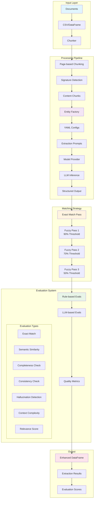

# Xtract

[](https://www.python.org/downloads/)
[](https://opensource.org/licenses/Apache-2.0)

A flexible and configurable document entity extraction and evaluation framework for processing structured documents like contracts, agreements, and legal documents.

## Table of Contents

- [Introduction](#introduction)
- [Why Xtract?](#why-xtract)
- [Architecture Overview](#architecture-overview)
- [Quick Start](#quick-start)
- [Installation](#installation)
- [Configuration](#configuration)
- [Core Components](#core-components)
- [Entity Extraction](#entity-extraction)
- [Evaluation System](#evaluation-system)
- [Testing](#testing)
- [Examples](#examples)
- [Contributing](#contributing)

## Introduction

Xtract is a Python framework designed for extracting structured information from unstructured document text using configurable YAML-based entity definitions and LLM-powered extraction. It processes documents through intelligent chunking, progressive matching strategies, and comprehensive evaluation pipelines.

## Why Xtract?

1. **YAML-Driven Configuration**: Define extraction entities and evaluation metrics through simple YAML files without code changes
2. **Intelligent Chunking**: Smart document chunking with signature page detection and page-based grouping
3. **Progressive Matching**: Multi-pass extraction with configurable strict vs. fuzzy thresholds for optimal recall
4. **Comprehensive Evaluation**: Built-in evaluation metrics including hallucination detection, completeness checks, and semantic similarity
5. **Flexible Model Support**: Support for OpenAI and Azure models with easy extensibility
6. **Performance Optimized**: Token caching, LRU eviction, and configurable batching for large-scale processing
7. **Multi-Format Support**: Process both pandas DataFrames and Spark DataFrames for different deployment scenarios

## Architecture Overview



## Quick Start

### 1. Install and Setup

```bash
# Clone the repository
git clone <repository-url>
cd xtract

# Create virtual environment
uv venv --python 3.11
source .venv/bin/activate  # On Windows: .venv\Scripts\activate

# Install dependencies
uv pip install -r requirements.txt
pip install -e .
```

### 2. Configure Your Environment

Create a `.env` file with your API keys:

```bash
# OpenAI API Key
OPENAI_API_KEY=your-openai-api-key-here

# Or Azure OpenAI
AZURE_OPENAI_API_KEY=your-azure-key
AZURE_OPENAI_ENDPOINT=your-endpoint
```

### 3. Run Extraction

```python
from xtract.core import Extractor

# Initialize extractor with configuration
extractor = Extractor(config_path="config/settings.yaml")

# Extract entities from your documents
results_df, extraction_results = extractor.extract(document_path="path/to/documents.csv")

# View results
print(f"Extracted {len(extraction_results)} entities")
print(results_df.head())
```

## Installation

### Prerequisites

- Python 3.11+
- OpenAI API key or Azure OpenAI credentials
- Virtual environment (recommended)

### From Source

```bash
git clone <repository-url>
cd xtract
pip install -e .
```

### Dependencies

Core dependencies are managed through `requirements.txt`:
- `pandas>=2.0.0` - Data manipulation
- `pyyaml>=6.0` - YAML configuration parsing
- `openai>=1.0.0` - OpenAI API integration
- `python-dotenv>=1.0.0` - Environment variable management

## Configuration

Xtract uses a hierarchical YAML-based configuration system:

### Main Settings (`config/settings.yaml`)

```yaml
mode: local  # local or databricks
sample_size: null  # null for all documents

# Chunking strategy
chunking:
  strategy: page  # page or character
  max_chars: 1000
  overlap: 100
  include_signatures: true

# Extraction matching
extraction:
  matching:
    exact_only: false
    fuzzy_passes: 3
    fuzzy_threshold_1: 0.90  # Strict first pass
    fuzzy_threshold_2: 0.70  # Medium second pass
    fuzzy_threshold_3: 0.50  # Lenient third pass

# Model configuration
model:
  provider: openai
  model_name: gpt-4o-mini
  temperature: 0.0
  max_tokens: 4096
```

### Entity Definitions (`config/extraction/`)

```yaml
# config/extraction/contract_type.yaml
enabled: true
prompt: |
  Extract the contract type from the following content.
  Return a JSON object with 'text' and 'value' fields.
  
  Content: {content}

context:
  examples: ["MSA", "NDA", "SOW", "License Agreement"]

format:
  type: "object"
  properties:
    text: "string"
    value: "string"
    confidence: "string"
```

### Evaluation Metrics (`config/evaluation/`)

```yaml
# config/evaluation/exact_match.yaml
enabled: true
method: exact_match
description: "Check if extracted text exactly matches source content"
```

## Core Components

### 1. Chunker (`xtract/core/chunker.py`)

Intelligent document chunking with signature page detection:

- **Page-based Strategy**: Groups content by page boundaries
- **Signature Detection**: Identifies signature pages using keyword matching
- **Smart Grouping**: Combines first page with signature pages for context
- **Configurable Overlap**: Maintains context between chunks

### 2. Entity Factory (`xtract/factory/entity_factory.py`)

Dynamic entity loading and management:

- **YAML-driven**: Load entities from configuration files
- **Dynamic Evaluation**: Associate entities with evaluation metrics
- **Context Variables**: Support for template-based prompt formatting
- **Model Overrides**: Per-entity model configuration

### 3. Extractor (`xtract/core/extractor.py`)

Core extraction pipeline with optimization features:

- **Progressive Matching**: Multi-pass extraction with decreasing thresholds
- **Token Caching**: LRU cache for frequently accessed content
- **Batching Support**: Configurable batch processing for large datasets
- **Multi-format Output**: Support for pandas and Spark DataFrames

### 4. Evaluator (`xtract/core/evaluator.py`)

Comprehensive evaluation system:

- **Rule-based Metrics**: Exact match, semantic similarity
- **LLM-powered Evaluation**: Hallucination detection, completeness checks
- **Configurable Thresholds**: Adjustable quality metrics
- **Batch Processing**: Efficient evaluation of large result sets

## Entity Extraction

### Defining Entities

Create YAML files in `config/extraction/` to define extraction entities:

```yaml
# config/extraction/signing_party.yaml
enabled: true
prompt: |
  Extract the signing parties from this contract.
  Look for company names, individual names, and their roles.
  
  Content: {content}

context:
  entity_type: "signing_party"
  examples: ["Company Name", "Individual Name", "Title"]

evaluations:
  exact_match: true
  completeness_check: true
  hallucination_detection: true
```

### Extraction Process

1. **Content Chunking**: Documents are split into manageable chunks
2. **Prompt Formatting**: Entity prompts are formatted with chunk content
3. **LLM Inference**: Structured extraction using configured models
4. **Progressive Matching**: Multiple passes with decreasing strictness
5. **Result Validation**: Output validation against expected formats

## Evaluation System

### Built-in Metrics

- **Exact Match**: Verify extracted text appears in source
- **Semantic Similarity**: Measure content similarity using fuzzy matching
- **Completeness Check**: Ensure all required fields are extracted
- **Consistency Check**: Validate consistency across extractions
- **Hallucination Detection**: Identify content not present in source
- **Context Complexity**: Assess extraction difficulty
- **Relevance Score**: Measure extraction relevance to entity type

### Custom Evaluations

Add custom evaluation metrics by creating YAML files in `config/evaluation/`:

```yaml
# config/evaluation/custom_metric.yaml
enabled: true
method: custom
description: "Custom evaluation logic"
parameters:
  threshold: 0.8
  custom_field: "value"
```

## Testing

Run the comprehensive test suite to ensure everything is working correctly:

```bash
# Run all tests using the test runner script
python tests/run_tests.py

# Run specific test files in execution order
python tests/01_test_data_loading.py
python tests/02_test_core_extraction.py
python tests/03_test_entity_extraction.py
python tests/04_test_evaluation.py
python tests/05_test_optimizations.py

# Run with coverage
python tests/run_tests.py --coverage

# Run with ruff formatting and checking
python tests/run_tests.py --ruff

# List all test files
python tests/run_tests.py --list
```

**Test Execution Order:**
The tests are designed to run sequentially based on the codebase execution logic:
1. **Data Loading** - Tests CSV loading and configuration
2. **Core Extraction** - Tests chunking and basic extraction pipeline
3. **Entity Extraction** - Tests entity-specific extraction logic
4. **Evaluation** - Tests evaluation pipeline integration
5. **Optimizations** - Tests advanced features and performance optimizations

## Examples

### Basic Extraction

```python
from xtract.core import Extractor

# Initialize extractor
extractor = Extractor(config_path="config/settings.yaml")

# Extract entities from document
results_df, extraction_results = extractor.extract(document_path="data/documents.csv")

# View results
print("Extracted entities:")
for entity_name, results in extraction_results.items():
    print(f"- {entity_name}: {len(results)} extractions")
```

### Custom Entity Configuration

```python
# config/extraction/custom_entity.yaml
enabled: true
prompt: |
  Extract {entity_type} information from the content.
  
  Content: {content}
  
  Return a JSON object with the following structure:
  {format}

context:
  entity_type: "custom_entity"
  examples: ["example1", "example2"]

evaluations:
  exact_match: true
  semantic_similarity: true
```

## Contributing

1. Fork the repository
2. Create a feature branch (`git checkout -b feature/amazing-feature`)
3. Commit your changes (`git commit -m 'Add amazing feature'`)
4. Push to the branch (`git push origin feature/amazing-feature`)
5. Open a Pull Request

### Development Setup

```bash
# Install development dependencies
pip install -e ".[dev]"

# Run linting
ruff check .
ruff format .

# Run tests
python tests/run_tests.py
```

## License

This project is licensed under the Apache License 2.0 - see the [LICENSE](LICENSE) file for details.

## Acknowledgments

- Built with modern Python best practices
- Inspired by document processing challenges in legal and business domains
- Designed for extensibility and maintainability

